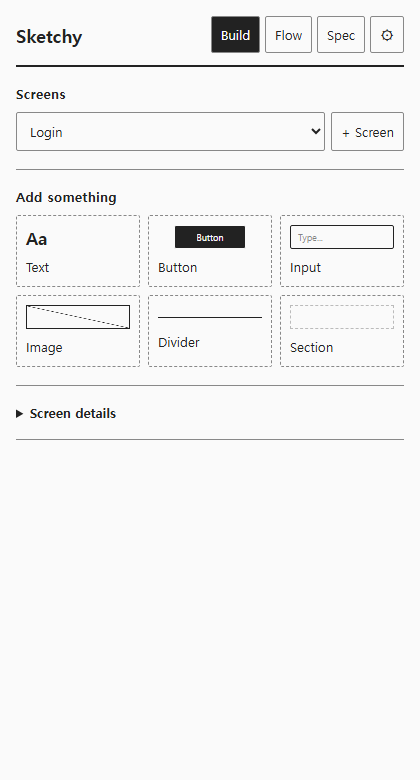
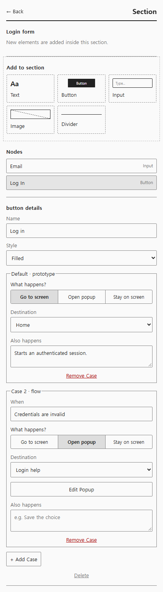
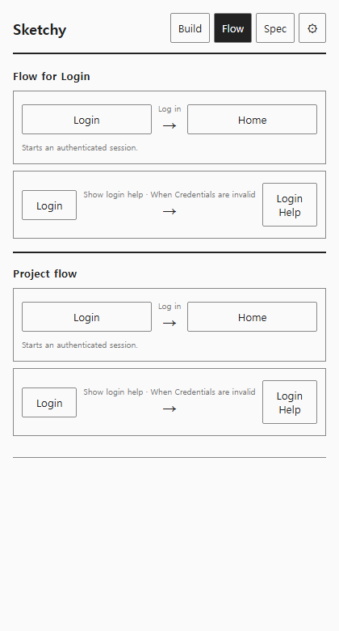
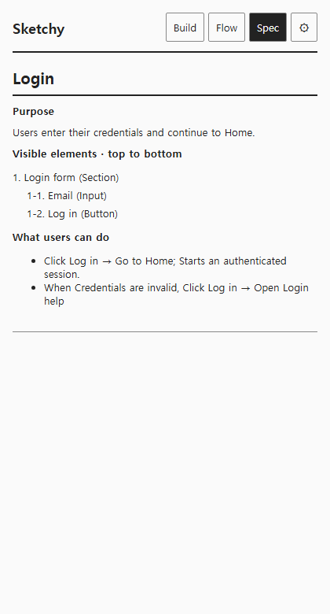
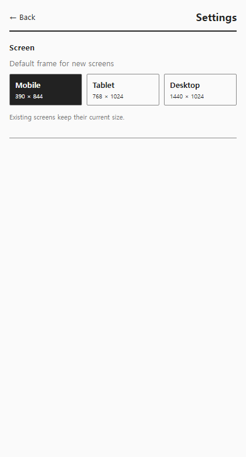

# Sketchy 기능 명세서

> 작성일: 2026-09-12  
> 기준: commit `256ccf6` + 기능 명세 워크플로 변경  
> 검증: Playwright Chromium 확인 / 코드 확인

## 1. 개요

Sketchy는 Figma 안에서 low-fi 화면을 만들고 버튼 동작을 연결하면 같은 데이터로 Flow와 Spec을 보여주는 플러그인이다. 이번 명세는 현재 Plugin UI와 Figma Runtime에 구현된 기능만 다룬다.

Playwright에서는 420×780 viewport와 현재 타입에 맞춘 예제 프로젝트를 사용해 Plugin UI를 확인했다. Figma Canvas 생성, Prototype 연결과 pluginData 저장은 브라우저에서 실행할 수 없어 코드를 확인했다.

## 2. 화면 목록

| 화면 ID | 화면명          | 진입 방법                     | 주요 기능                                  |
| ------- | --------------- | ----------------------------- | ------------------------------------------ |
| SCR-01  | Build           | 상단 Build 탭                 | Screen 선택·생성, Block 추가, Screen 관리  |
| SCR-02  | Element details | Figma Canvas에서 Element 선택 | Element 편집, Button 동작과 조건 Case 설정 |
| SCR-03  | Flow            | 상단 Flow 탭                  | 선택 Screen과 전체 프로젝트의 연결 확인    |
| SCR-04  | Spec            | 상단 Spec 탭                  | 화면 목적, 요소 순서, 사용자 행동 확인     |
| SCR-05  | Settings        | 우측 설정 버튼                | 새 Screen의 기본 크기 선택                 |

## 3. 화면별 기능

### SCR-01 Build

| 기능 ID  | 기능명           | 사용자 동작                                       | 결과                                           | 확인 방법                   | 제한사항                                 |
| -------- | ---------------- | ------------------------------------------------- | ---------------------------------------------- | --------------------------- | ---------------------------------------- |
| BUILD-01 | Screen 선택      | Screens 목록에서 Screen 선택                      | Figma 선택과 Build 문맥이 해당 Screen으로 이동 | Playwright 확인 / 코드 확인 | 실제 Canvas 선택은 Figma 호스트 필요     |
| BUILD-02 | Screen 추가      | `+ Screen` 클릭                                   | 설정된 크기의 새 Screen을 Canvas에 생성        | 코드 확인                   | 이름은 `Screen N`으로 자동 생성          |
| BUILD-03 | Block 추가       | Text, Button, Input, Image, Divider, Section 선택 | 현재 Screen 또는 Section에 low-fi Element 생성 | Playwright 확인 / 코드 확인 | Section 안에는 Section을 중첩할 수 없음  |
| BUILD-04 | Screen 정보 편집 | Screen details에서 Name 또는 Purpose 편집         | Screen 이름과 목적을 저장하고 Canvas 표시 갱신 | Playwright 확인 / 코드 확인 | 입력창을 벗어날 때 저장                  |
| BUILD-05 | Screen 복제      | `Duplicate screen` 클릭                           | Screen과 하위 Element를 새 ID로 복제           | 코드 확인                   | 연결 Feature는 복제하지 않음             |
| BUILD-06 | Screen 삭제      | `Delete screen` 클릭 후 확인                      | 원본, 파생 State, 관련 Feature와 연결 제거     | 코드 확인                   | 되돌릴 수 없으며 영향 수를 확인창에 표시 |

### SCR-02 Element details

| 기능 ID | 기능명             | 사용자 동작                           | 결과                                                | 확인 방법                   | 제한사항                                 |
| ------- | ------------------ | ------------------------------------- | --------------------------------------------------- | --------------------------- | ---------------------------------------- |
| ELEM-01 | Element 이름 변경  | Name 편집 후 입력창을 벗어남          | 이름과 설명을 저장하고 Canvas 표시 갱신             | Playwright 확인 / 코드 확인 | Block별 편집 항목은 다름                 |
| ELEM-02 | Button 스타일 선택 | Filled 또는 Outline 선택              | Canvas Button 스타일 변경                           | Playwright 확인 / 코드 확인 | Button에만 제공                          |
| ELEM-03 | 화면으로 이동      | `Go to screen`과 목적지 선택          | 기본 Case면 Figma Navigate Prototype 생성           | Playwright 확인 / 코드 확인 | 목적지가 없으면 연결하지 않음            |
| ELEM-04 | Popup 열기         | `Open popup`과 Popup State 선택       | 같은 원본 Screen의 파생 State를 Overlay로 연결      | Playwright 확인 / 코드 확인 | 중첩 Popup과 다른 원본의 State는 제외    |
| ELEM-05 | 화면에 머무르기    | `Stay on screen` 선택 후 결과 작성    | 비시각 결과를 Flow와 Spec에 기록                    | Playwright 확인 / 코드 확인 | 실행 가능한 Figma action은 만들지 않음   |
| ELEM-06 | 조건 Case 추가     | `+ Add Case` 클릭 후 When과 결과 입력 | 같은 Trigger의 조건부 대안을 Flow와 Spec에 추가     | Playwright 확인 / 코드 확인 | Figma가 조건을 실행하는 Prototype은 아님 |
| ELEM-07 | 부수효과 기록      | Also happens 작성                     | 대표 결과와 함께 일어나는 내용을 Flow와 Spec에 보존 | Playwright 확인             | 자유 텍스트                              |
| ELEM-08 | Element 삭제       | Delete 클릭                           | Element, 하위 Element, 연결 Feature와 reaction 제거 | 코드 확인                   | 확인창 없이 즉시 실행                    |

### SCR-03 Flow

| 기능 ID | 기능명              | 사용자 동작                            | 결과                                                | 확인 방법                   | 제한사항                            |
| ------- | ------------------- | -------------------------------------- | --------------------------------------------------- | --------------------------- | ----------------------------------- |
| FLOW-01 | 선택 화면 Flow 확인 | Flow 탭 진입                           | 선택 Screen에서 나가거나 들어오는 Feature 표시      | Playwright 확인             | 선택 Screen이 없으면 이 영역을 숨김 |
| FLOW-02 | 전체 Flow 확인      | Flow 탭 진입                           | 프로젝트의 모든 Feature를 출발지·결과·목적지로 표시 | Playwright 확인             | 자동 배치 Canvas가 아닌 세로 목록   |
| FLOW-03 | 연결 화면 선택      | 출발지 또는 목적지 클릭                | Figma Canvas에서 해당 Screen 선택 요청              | Playwright 확인 / 코드 확인 | 실제 선택은 Figma 호스트 필요       |
| FLOW-04 | 미완성 연결 표시    | 목적지 없는 Navigate 또는 Overlay 확인 | `Choose destination · not linked` 표시              | 코드 확인                   | 자동 수정하지 않음                  |

### SCR-04 Spec

| 기능 ID | 기능명              | 사용자 동작  | 결과                                                               | 확인 방법                   | 제한사항                                    |
| ------- | ------------------- | ------------ | ------------------------------------------------------------------ | --------------------------- | ------------------------------------------- |
| SPEC-01 | 화면 목적 확인      | Spec 탭 진입 | 선택 Screen의 이름과 Purpose 표시                                  | Playwright 확인             | Screen 단위 명세만 제공                     |
| SPEC-02 | 요소 읽기 순서 확인 | Spec 탭 진입 | 실제 Canvas 위치 기준 위→아래, 같은 줄 왼쪽→오른쪽으로 표시        | Playwright 확인 / 코드 확인 | Canvas 위치 조회는 Figma 호스트 필요        |
| SPEC-03 | 사용자 행동 확인    | Spec 탭 진입 | Feature의 Trigger, 조건, Action, 목적지와 부수효과를 문장으로 표시 | Playwright 확인             | 파일 내보내기와 전체 프로젝트 복사는 미지원 |

### SCR-05 Settings

| 기능 ID | 기능명                 | 사용자 동작                          | 결과                                  | 확인 방법                   | 제한사항                       |
| ------- | ---------------------- | ------------------------------------ | ------------------------------------- | --------------------------- | ------------------------------ |
| SET-01  | 기본 Screen 크기 선택  | Mobile, Tablet, Desktop 중 하나 선택 | 이후 생성하는 Screen의 기본 크기 저장 | Playwright 확인 / 코드 확인 | 기존 Screen 크기는 바꾸지 않음 |
| SET-02  | 작업 화면으로 돌아가기 | Back 클릭                            | 이전 Workspace 문맥으로 복귀          | Playwright 확인             | 별도 URL route는 사용하지 않음 |

## 4. 공통 기능

| 기능 ID   | 기능명               | 설명                                                               | 확인 방법       |
| --------- | -------------------- | ------------------------------------------------------------------ | --------------- |
| COMMON-01 | Build·Flow·Spec 전환 | 상단 탭 하나로 같은 Project 데이터를 다른 관점에서 표시            | Playwright 확인 |
| COMMON-02 | Figma 선택 동기화    | Canvas 선택 변경을 Plugin UI의 Screen·Element 문맥에 반영          | 코드 확인       |
| COMMON-03 | 오류 안내            | Runtime 오류를 상단 alert로 표시하고 8초 뒤 제거                   | 코드 확인       |
| COMMON-04 | 단일 데이터 재사용   | Screen, Element, Feature 데이터를 Canvas, Flow, Spec에서 함께 사용 | 코드 확인       |

## 5. 데이터와 상태

- `Project`는 `settings`, `screens`, `elements`, `features`를 가진다.
- Screen과 Element는 Figma `nodeId`와 별도 Sketchy ID를 함께 저장한다.
- Popup은 별도 상태 엔진이 아니라 `kind: popup`, `baseScreenId`를 가진 파생 Screen이다.
- Button의 첫 Feature는 실행 가능한 기본 Case이며 이후 Feature는 `condition`을 가진 Flow용 Case다.
- Plugin UI는 `postMessage`로 Command를 보내고 Runtime은 처리 후 전체 `STATE`를 다시 보낸다.
- Canvas 구조와 프로젝트 데이터는 Figma `pluginData`를 통해 유지된다.

## 6. 제한사항과 미지원 범위

- 브라우저 Playwright는 Figma Canvas API를 실행하지 못하므로 Canvas 생성, 선택, Prototype reaction과 pluginData 저장은 코드로 확인했다.
- Input은 현재 이름 변경과 배치만 지원하며 값, 필수 여부, validation, change·submit Feature 설정은 없다.
- 조건 Case는 Flow와 Spec에 문서화되지만 실제 조건부 Figma Prototype으로 실행되지 않는다.
- Spec은 현재 선택 Screen만 보여주며 전체 프로젝트 Markdown 내보내기나 복사 기능은 없다.
- Present Mode, 자유 배치 Flow Map, JSON·PDF Export와 Screenshot import는 현재 구현 범위가 아니다.
